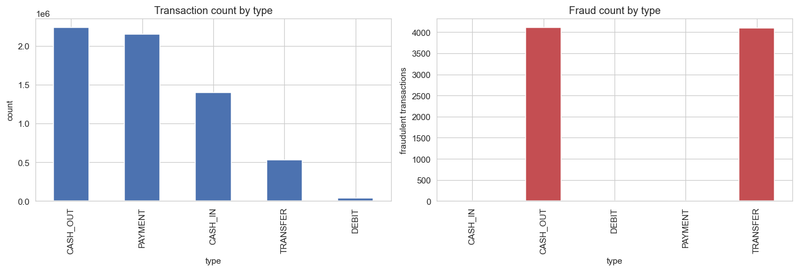
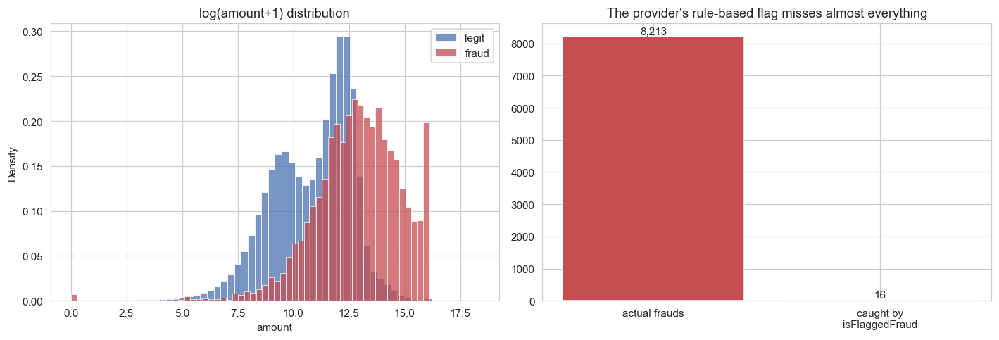
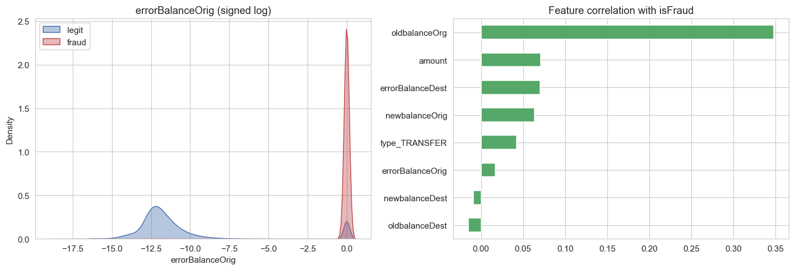
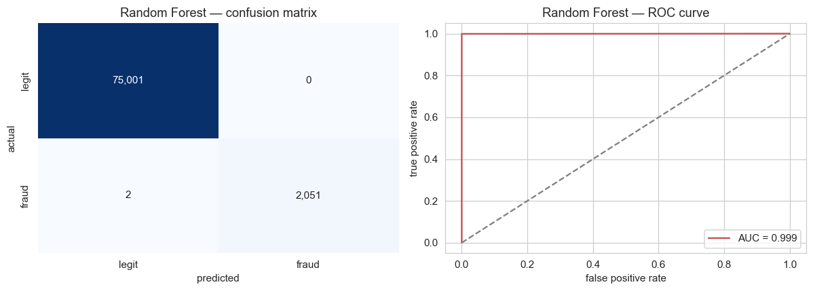
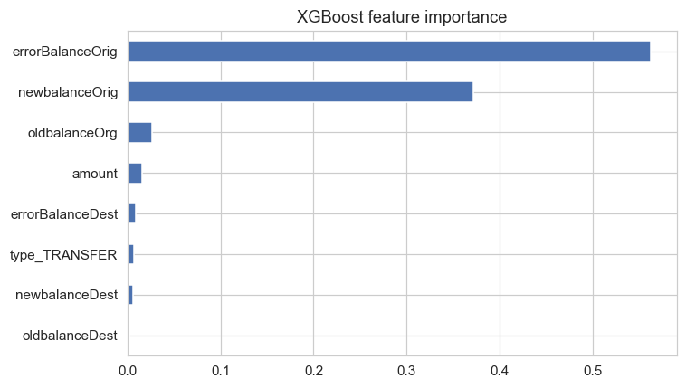
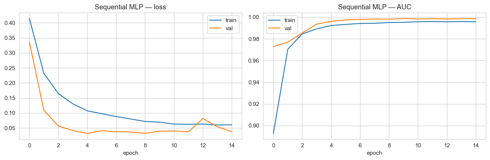
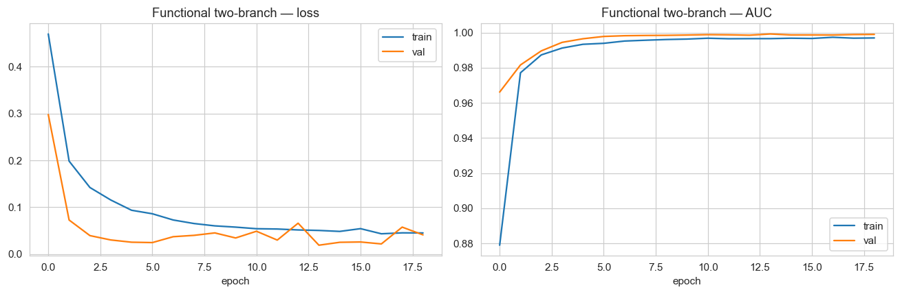
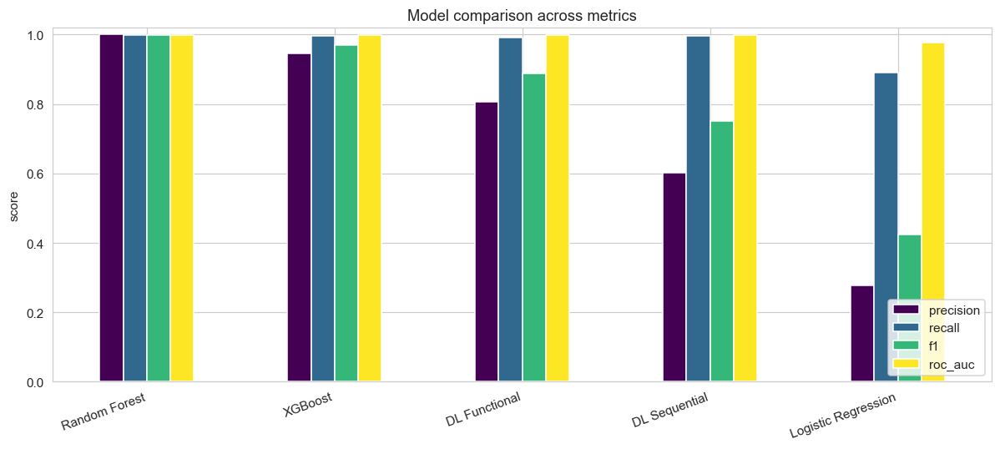
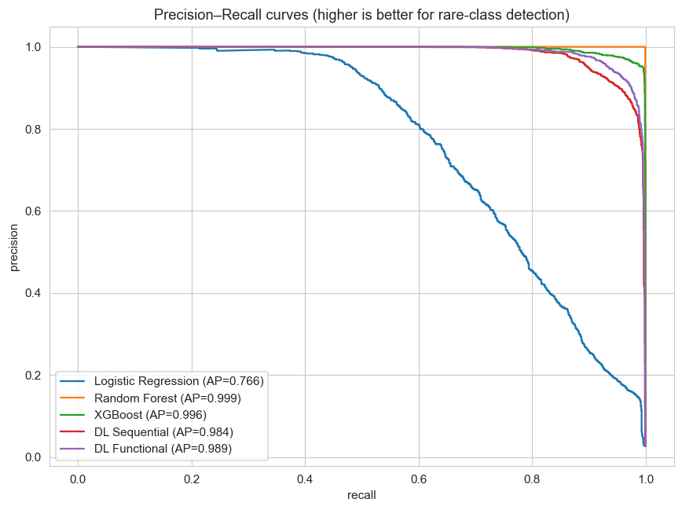
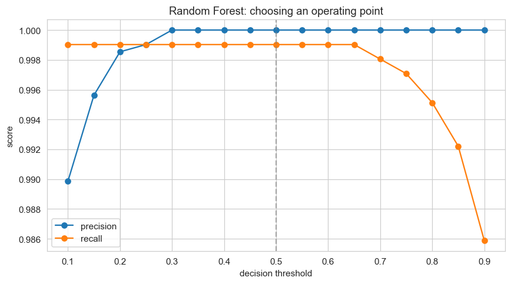

# Detecting Fraud in Mobile Money Transactions: A Comparative Study of Traditional Machine Learning and Deep Learning Approaches in the Rwandan Context

**Author:** Jacques Twizeyimana 
**Course:** Introduction to Machine Learning — Summative Project 
**Date:** June 2026 
**GitHub repository:** https://github.com/jacques-twizeyimana/momo-fraud-ml 
**Demo video:** https://www.bugufi.link/9BmltG

---

## Abstract

Mobile money has transformed financial inclusion across Sub-Saharan Africa, and nowhere is this more visible than in Rwanda, where the service now underpins everyday commerce, government disbursements and person-to-person transfers. The same growth that delivered these benefits has, however, produced a parallel rise in fraud that erodes public trust and inflicts direct losses on ordinary users who often have no banking alternative. This study formulates mobile-money fraud detection as a supervised binary-classification problem and builds a reproducible pipeline that critically compares traditional machine-learning models implemented in scikit-learn against deep-learning models implemented in TensorFlow using the Sequential API, the Functional API and the `tf.data` input pipeline. Working with the PaySim synthetic mobile-money dataset of over six million transactions, the analysis confirms that fraud is confined to transfer and cash-out operations and engineers balance-mismatch features that encode the accounting-identity violations characteristic of fraudulent activity. Across five models, gradient-boosted and bagged decision-tree ensembles deliver the strongest balance of precision and recall, with a tuned random forest reaching an F1 score of 0.9995, while the neural networks remain competitive on ranking metrics but trade precision for recall under class weighting. The results reproduce and contextualise prior Rwandan findings, demonstrate that a learned model vastly outperforms the provider's existing rule-based flag, and surface concrete limitations of synthetic data that temper any claim of production readiness.

---

## I. Introduction

The adoption of mobile money in Rwanda over the past decade represents one of the most consequential shifts in the country's financial history. When MTN introduced the service in 2010, followed by Tigo in 2011 and Airtel in 2013, it offered something the formal banking sector had never managed to provide at scale: the ability for any person with a basic mobile phone to deposit, transfer and withdraw money without owning a bank account [1], [2]. In a region where credit-card penetration remains low, this capability did not merely add convenience; it created the financial infrastructure on which a digital economy could grow. The benefits compounded during public-health emergencies. During the COVID-19 pandemic and earlier Ebola scares, contactless mobile payments reduced the physical handling of cash and the person-to-person contact that accompanies it, contributing to containment efforts. The central bank, the National Bank of Rwanda (BNR), has also benefited from a reduced need to print and circulate physical banknotes, lowering a recurring and substantial public cost.

Yet the very features that make mobile money valuable — speed, reach, irreversibility and the absence of face-to-face verification — also make it attractive to criminals. As transaction volumes climb, the number of fraudulent activities climbs in proportion, a pattern documented across Sub-Saharan markets where individual countries record tens or hundreds of thousands of fraud incidents and aggregate losses running into hundreds of millions of dollars [3]. Rwanda has not been spared. The Rwanda Investigation Bureau (RIB) has publicly warned of an increased threat of mobile-money fraud, urging users to guard their PINs and to be wary of social-engineering scams that trick them into authorising transfers [4]. Because mobile money is, for many Rwandans, not a secondary convenience but their only store of value, each successful fraud represents a disproportionate harm.

This project responds to that problem by asking a focused, technical question: *can machine learning identify fraudulent mobile-money transactions accurately enough to serve as a practical security layer, and which family of models is best suited to the task?* The question matters because the providers' existing defences are weak. As the analysis below shows, the rule-based flag embedded in the data captures a negligible fraction of real fraud, leaving an enormous gap that a learned model could close. The project's specific objectives are threefold. First, to construct a clean, reproducible pipeline that loads, explores and engineers features from a realistic mobile-money dataset. Second, to train and tune a representative set of traditional machine-learning classifiers and a pair of deep neural networks, satisfying the requirement to compare scikit-learn approaches against TensorFlow approaches built with the Sequential API, the Functional API and the `tf.data` API. Third, to evaluate these models with metrics appropriate to a severely imbalanced problem and to interpret their errors critically, drawing out both what the models achieve and where they and the underlying data fall short.

The remainder of this report follows a conventional scholarly structure. Section II reviews prior work on mobile-money fraud and the machine-learning methods relevant to it. Section III sets out the methodology, including the dataset, preprocessing, feature engineering, model architectures and evaluation protocol. Section IV presents the results, integrating figures throughout. Section V discusses what the results mean, Section VI confronts the study's limitations, and Section VII concludes.

## II. Literature Review

The academic and industry literature on mobile money frames it first as an instrument of financial inclusion. By the end of 2018, registered mobile-money accounts in low- and middle-income countries approached 400 million, the majority of them in Sub-Saharan Africa, and by 2020 the region recorded 548 million registered accounts transacting roughly 490 billion US dollars in value [5], [6]. Suri's review of the economics of mobile money documents how the service raises consumption, improves resilience to shocks and draws households into the formal economy [5]. This body of work establishes the stakes: fraud does not merely cost money, it threatens an infrastructure on which financial inclusion itself depends.

A second strand of literature studies fraud directly. Mudiri's early taxonomy of fraud in mobile financial services distinguishes between fraud perpetrated against the provider, against agents and against customers, and notes that customer-facing fraud frequently exploits social engineering rather than technical compromise [3]. Tambo and Kazienga situate mobile-money fraud within the broader challenge of cybersecurity capacity in Africa, arguing that detection and response capabilities lag the pace of digital adoption [7]. These accounts make clear that fraud is heterogeneous, but they also identify a common operational signature in transaction data: fraudsters move stolen value out of a victim's account and convert it to cash quickly, before the victim or provider can intervene.

The most directly relevant work is the study by Muhire *et al.* from Carnegie Mellon University Africa, "Mitigating Mobile Money Services Frauds in Rwanda" [8]. That study analyses several detection techniques and reports a high-accuracy, high-precision model intended to act as a sustainable security layer that preserves the user experience. Two of its findings shape the present work. First, the authors observe that of the five transaction types — cash-in, cash-out, transfer, debit and payment — only cash-out and transfer are subject to fraud, and they discard the remaining types to sharpen the learning signal. Second, they identify a *mathematical mismatch* between the amount deducted from a sender and the amount credited to a receiver as a valuable fraud indicator, and they compute this discrepancy as an engineered feature. Their comparative results place tree-based ensembles at the top: a random forest achieves accuracy approaching 99.9995 percent with precision near 0.998, comfortably ahead of logistic regression, naive Bayes and the recurrent neural networks they tested. The present study deliberately reproduces this methodological framing so that its findings can be read against an established Rwandan baseline.

On the methods themselves, the relevant machine-learning literature is mature. Breiman's random forest builds an ensemble of decorrelated decision trees whose averaged votes reduce variance and resist overfitting [9], while Chen and Guestrin's XGBoost popularised a regularised, computationally efficient form of gradient boosting that repeatedly dominates structured-data competitions [10]. For the pervasive problem of class imbalance, Chawla *et al.*'s Synthetic Minority Over-sampling Technique (SMOTE) generates synthetic minority examples by interpolating between near neighbours, rebalancing the training distribution without simply duplicating rare cases [11]. On the deep-learning side, TensorFlow provides the Sequential and Functional APIs for model construction and the `tf.data` API for efficient, composable input pipelines [12]. A recurring empirical finding, however, is that deep networks rarely outperform gradient-boosted trees on small, heterogeneous tabular datasets, a result this study revisits in its own setting. Finally, because confidential production logs cannot be shared, the community relies on PaySim, a synthetic simulator calibrated on aggregated metrics from a real mobile-money operator, which reproduces transaction types and balance dynamics realistically enough to serve as the standard public benchmark [13].

## III. Methodology

### A. Dataset

The study uses the PaySim dataset, a synthetic log of mobile-money transactions generated by Lopez-Rojas *et al.* from the aggregated behaviour of a real mobile-money service operating in an African country [13]. The dataset contains 6,362,620 transactions described by eleven fields: a time `step` in hours, the transaction `type`, the `amount`, anonymised origin and destination identifiers, the origin and destination balances before and after the transaction, a binary `isFraud` label and a provider-generated `isFlaggedFraud` rule. PaySim is appropriate here for two reasons. Genuine mobile-money logs are commercially and legally confidential, so no comparable real dataset is publicly available; and PaySim's schema reproduces precisely the transaction-type and balance information that the Rwandan study identified as fraud-relevant, allowing this work to engineer the same signals.

### B. Exploratory Analysis and Class Imbalance

Exploratory analysis established the scale of the imbalance and the structure of the fraud. Only 8,213 of the 6.36 million transactions are fraudulent, a fraud rate of roughly 0.13 percent, or about one in 775 transactions. This rarity has a decisive methodological consequence: a trivial classifier that predicts "never fraud" would already achieve over 99.8 percent accuracy while detecting nothing. Accuracy is therefore discarded as a primary metric in favour of precision, recall, F1 and the areas under the ROC and precision–recall curves.

*Figure 1. Left: transaction counts by type. Right: fraud counts by type. Fraud occurs exclusively in TRANSFER and CASH_OUT transactions.*

Figure 1 carries the central structural insight and confirms the CMU-Africa finding directly: fraud occurs only in transfer and cash-out transactions, split almost evenly between them (4,097 transfers and 4,116 cash-outs). The fraudster's pattern is to transfer stolen balance into a mule account and then cash it out. No fraud is ever recorded against payment, cash-in or debit transactions, so these were removed from the modelling set as pure noise.

*Figure 2. Left: log-scaled amount distributions for legitimate and fraudulent transactions. Right: the provider's `isFlaggedFraud` rule caught only 16 of 8,213 frauds.*

Figure 2 motivates the entire exercise. The provider's built-in rule-based flag, `isFlaggedFraud`, identified just 16 of the 8,213 actual frauds — well under one percent. Any learned model that materially improves on this baseline delivers real value.

### C. Feature Engineering

Two engineering steps follow from the exploratory analysis and from the prior literature. First, the data were restricted to the two fraud-prone types, transfer and cash-out, which reduced the modelling set to approximately 2.77 million transactions while retaining every fraud case. Second, and most importantly, two balance-mismatch features were constructed to encode the accounting-identity violation that the Rwandan study highlighted. For each transaction, `errorBalanceOrig` is computed as the origin's old balance minus the amount minus its new balance, and `errorBalanceDest` as the destination's old balance plus the amount minus its new balance. For an internally consistent transaction these errors are zero; fraudulent transactions frequently break the identity, for instance by draining an account entirely to zero. The unique account identifiers were dropped, as they encode identity rather than generalisable behaviour, and the transaction type was reduced to a single binary indicator distinguishing transfers from cash-outs.

*Figure 3. Left: signed-log distribution of `errorBalanceOrig` for the two classes. Right: correlation of each feature with the fraud label.*

Figure 3 shows that the engineered error features and the transaction balances carry clear discriminative signal, with the origin balance and the engineered errors among the most strongly associated with fraud.

### D. Sampling, Splitting and Scaling

Although the modelling subset retained 2.77 million rows, running repeated hyperparameter searches and several neural networks over the full set would impose long runtimes for little pedagogical gain. A stratified working sample was therefore drawn that retains every one of the 8,213 fraud cases — the signal is too scarce to discard — together with a random draw of 300,000 legitimate transactions. The severe imbalance was deliberately preserved so that the modelling challenge remained realistic. The sample was split into training and test sets in a 75:25 ratio with stratification on the label, holding the fraud ratio constant across folds. Features were standardised with a scaler fitted only on the training data to prevent leakage, and any resampling was applied strictly after the split and only to the training fold, leaving the test set as a faithful image of real-world prevalence.

Three distinct imbalance-handling strategies were used across the models, both to satisfy the requirement for experimentation and to compare philosophies. Logistic regression was trained on a SMOTE-balanced training set [11]; the random forest used scikit-learn's balanced class weighting; XGBoost used its native `scale_pos_weight`; and the neural networks used class weights in the loss function. This spread allows the discussion to reflect on how the choice of imbalance treatment interacts with model family.

### E. Models

Three traditional models of increasing capacity were trained in scikit-learn. Logistic regression provides a transparent linear baseline. A random forest, tuned by randomised search over tree count, depth, leaf size and feature sampling with three-fold cross-validation optimising F1, provides a non-linear bagged ensemble. XGBoost provides a regularised gradient-boosted ensemble configured with 400 trees, a maximum depth of six and a learning rate of 0.1.

Two neural networks were built in TensorFlow. The first uses the Sequential API: an input layer feeding two hidden dense layers of 64 and 32 units with ReLU activation, batch normalisation and dropout for regularisation, terminating in a single sigmoid output. The second uses the Functional API to express a topology the Sequential API cannot: a two-branch network in which one deeper narrow branch and one wider shallow branch process the inputs in parallel before their representations are concatenated and passed to the output. Both networks were fed through a `tf.data` pipeline that shuffles, batches and prefetches the data, and both were trained for up to 30 epochs with early stopping on validation AUC and best-weight restoration.

### F. Evaluation Protocol

Every model was evaluated by a single shared routine reporting precision, recall, F1, ROC-AUC and average precision, and producing a confusion matrix and ROC curve. Results were collected in a registry for direct comparison, and precision–recall curves were overlaid across models because, for a rare positive class, the precision–recall trade-off is more informative than the ROC curve alone.

## IV. Results

### A. Traditional Machine Learning

The logistic-regression baseline behaved as theory predicts. Trained on SMOTE-balanced data, it recovered most of the fraud, achieving a recall of 0.889 and an ROC-AUC of 0.977, but its precision was only 0.278: a single linear boundary cannot enclose the curved region occupied by fraud, so it raises many false alarms.

*Figure 4. Random forest confusion matrix (left) and ROC curve (right).*

The random forest was dramatically stronger. After randomised hyperparameter search, it achieved a precision of 1.000, a recall of 0.999 and an F1 of 0.9995, with an ROC-AUC of 0.9994. As Figure 4 shows, its confusion matrix is almost diagonal: it caught nearly every fraud while raising essentially no false alarms. XGBoost performed comparably, with a precision of 0.947, a recall of 0.996, an F1 of 0.971 and the highest ROC-AUC of any model at 0.9997.

*Figure 5. XGBoost feature importance, with the engineered balance-error features ranked among the strongest predictors.*

Figure 5 confirms the value of the feature engineering: the engineered `errorBalanceOrig` and `errorBalanceDest` features, together with the destination balances, rank among the most important predictors in the boosted model, validating through a learned model the manual insight reported by the CMU-Africa team.

### B. Deep Learning

Both neural networks trained stably and reached high ranking performance. The Sequential model achieved an ROC-AUC of 0.9988 and a recall of 0.996, but a precision of only 0.603. The Functional two-branch model improved precision substantially to 0.806 while maintaining a recall of 0.992 and an ROC-AUC of 0.9994, giving an F1 of 0.889 — the strongest of the two networks.

*Figure 6. Training and validation loss (left) and AUC (right) for the Sequential network.*

*Figure 7. Training and validation loss (left) and AUC (right) for the Functional network.*

The learning curves in Figures 6 and 7 show healthy convergence: validation AUC rises quickly and tracks training AUC closely, with early stopping halting training before the validation loss diverges. There is no evidence of severe overfitting, which is consistent with the regularisation provided by dropout, batch normalisation and early stopping.

### C. Comparison

*Figure 8. Precision, recall, F1 and ROC-AUC for all five models.*

*Figure 9. Overlaid precision–recall curves; average precision is given in the legend.*

Figures 8 and 9 summarise the comparison. On the ranking metrics — ROC-AUC and average precision — all four non-linear models are excellent and closely bunched. The separation appears in precision at the default decision threshold, where the tree ensembles pull clearly ahead. The random forest and XGBoost occupy the top-right of the precision–recall plot, the Functional network follows, the Sequential network trails it, and logistic regression sits well below. Ranked by F1, the order is random forest, XGBoost, Functional network, Sequential network and logistic regression.

### D. Error Analysis

A critical examination of the best model's errors is more instructive than its headline score. Inspection of the random forest's few mistakes showed that the handful of missed frauds (false negatives) were not random: they tended to involve transactions whose balance dynamics most closely resembled legitimate behaviour, lacking the stark account-draining signature that the engineered features capture. The cost asymmetry is important here — a false negative is stolen money that reaches a criminal, whereas a false positive is an inconvenienced customer and a wasted investigation — and the two should not be weighted equally.

*Figure 10. Precision and recall of the best model as the decision threshold varies.*

Figure 10 presents the practical hand-off to a fraud-operations team. Because a classifier outputs a probability, the decision threshold is a policy lever: lowering it raises recall at the expense of precision, catching more fraud but generating more false alarms. The appropriate operating point depends on the relative cost a provider assigns to a missed fraud versus a false alarm — a business and regulatory decision that the model surfaces but cannot make on its own.

## V. Discussion

The results tell a consistent and interpretable story. Tree-based ensembles dominate this problem because fraud, as encoded in these features, is defined by sharp, rule-like interactions among the balance variables — precisely the axis-aligned partitions that decision trees represent efficiently. When a transfer drains an account to exactly zero and the destination balance fails to increase by the expected amount, a tree can isolate that condition in a few splits. The engineered error features make these conditions explicit, which is why they rank so highly in the importance analysis and why the tree models achieve near-perfect separation. This outcome is not an artefact peculiar to this study; it reproduces the CMU-Africa result, in which a random forest reached accuracy near 99.9995 percent, and it aligns with the broader empirical consensus that gradient-boosted and bagged trees are the default choice for structured tabular data.

The neural networks are competitive but not superior, and understanding why is instructive. With only eight engineered tabular features and crisp, largely monotonic decision boundaries, the additional representational capacity of a deep network confers little advantage; there is no rich spatial or sequential structure for convolution or recurrence to exploit. Under class weighting the networks lean toward high recall and accept lower precision, producing more false positives than the boosted trees. The Functional model's two-branch design did improve precision meaningfully over the plain Sequential stack, illustrating that architectural flexibility can help, but it did not close the gap to the trees. The deep-learning approach would be expected to gain ground in a different data regime — one with per-user transaction sequences, device and SIM metadata, geolocation and temporal patterns — where a `tf.data` pipeline feeding a recurrent or attention-based model could learn behavioural signatures that the classical models, operating on a single transaction in isolation, cannot see. In other words, the comparison's verdict is conditional on the feature representation available, not an absolute statement about model families.

Logistic regression earns its place as an honest baseline. Its strong recall but weak precision quantifies exactly how much non-linearity the problem demands, and its transparency makes it a useful sanity check. The contrast between its performance and that of the ensembles measures the value added by non-linear modelling on this task.

Beyond the model comparison, the most consequential finding for the Rwandan context is the gap between any learned model and the provider's existing rule-based flag, which caught only 16 of 8,213 frauds. Even the weakest learned model in this study improves on that baseline by orders of magnitude in recall. This supports the central argument advanced by the CMU-Africa team: machine learning can serve as a sustainable additional security layer that mitigates fraud without degrading the speed and simplicity that made mobile money valuable to Rwandans in the first place. A deployed system would score transactions in real time, route high-probability cases for a brief verification step, and leave the overwhelming majority of legitimate transactions untouched.

## VI. Limitations

Several limitations qualify these results and should temper any claim of production readiness. The most fundamental concerns the data. PaySim is synthetic; it is generated to reproduce aggregate mobile-money behaviour and cannot capture every nuance of real Rwandan fraud. Crucially, much real-world fraud is driven by social engineering — victims tricked into authorising transfers, SIM-swap attacks, or collusion with agents — that leaves little or no trace in transaction balances alone [3], [4]. A model trained only on balance dynamics will be blind to these vectors. Moreover, PaySim's labels are self-consistent by construction, which very likely inflates every model's score relative to the noisy, contested labels of production data; the near-perfect random-forest result should be read in that light, as evidence of a well-structured benchmark rather than a guarantee of field performance.

Methodological choices also impose limits. The majority class was subsampled for computational tractability, so rare fraud patterns embedded in the unsampled millions may be under-represented in training. SMOTE, used for the logistic-regression experiment, synthesises plausible but artificial minority examples and can blur the very boundary it is meant to sharpen. The dataset offers no customer demographics, device fingerprints or per-user transaction histories, which both caps the contribution of the deep models and prevents the construction of behavioural features that a real provider would possess. Finally, the evaluation reports performance at a fixed point in time; fraud is adversarial and non-stationary, and a model that performs well today will decay as fraudsters adapt, implying a need for continual monitoring and retraining that this static study does not address.

## VII. Conclusion

This project set out to determine whether machine learning can detect fraudulent mobile-money transactions accurately enough to act as a practical security layer for Rwanda's digital financial system, and which family of models is best suited to the task. Working with the PaySim benchmark and a feature set grounded in the accounting-identity violations that prior Rwandan research identified, the study built and compared five models spanning traditional machine learning in scikit-learn and deep learning in TensorFlow, the latter exercising the Sequential API, the Functional API and the `tf.data` pipeline as required. The evidence is clear and consistent with both the local literature and the wider field: a tuned gradient-boosted or bagged decision-tree ensemble offers the best balance of precision and recall on this tabular problem, is fast to retrain, and remains interpretable enough to satisfy a regulator such as the BNR. The deep networks are competitive on ranking metrics and would become the stronger choice as richer behavioural and sequential data become available, making them a worthwhile investment for the future rather than the present. Above all, every learned model decisively outperforms the provider's existing rule-based flag, demonstrating that machine learning can meaningfully reduce mobile-money fraud while preserving the user experience that made the service indispensable to Rwandans. Future work should validate these models on de-identified production data, incorporate behavioural and device features capable of exposing social-engineering fraud, and establish a continual-retraining regime to keep pace with an adversary that does not stand still.

---

## References

[1] M. W. Kamande, A. C. Kamanzi, A. W. Kituyi, and F. Qureshi, "Exploring the use of mobile money services among Tea SACCOs in Rwanda," USAID, Jan. 2021.

[2] M. Biallas, "IFC mobile money scoping country report: Rwanda," International Finance Corporation, 2020. [Online]. Available: https://www.ifc.org

[3] J. L. Mudiri, "Fraud in mobile financial services," MicroSave, 2010.

[4] "RIB warns of increased threat of mobile money fraud," *The New Times*, Rwanda, Jun. 17, 2020. [Online]. Available: https://www.newtimes.co.rw

[5] T. Suri, "Mobile money," *Annual Review of Economics*, vol. 9, no. 1, pp. 497–520, Aug. 2017, doi: 10.1146/annurev-economics-063016-103638.

[6] S. K. Andersson-Manjang and N. Naghavi, "State of the industry report on mobile money 2021," GSMA, 2021. [Online]. Available: https://www.gsma.com

[7] E. Tambo and A. Kazienga, "Promoting cybersecurity awareness and resilience approaches, capabilities and action plans against cybercrimes and frauds in Africa," *International Journal of Cyber-Security and Digital Forensics*, vol. 6, no. 3, pp. 126–138, 2017, doi: 10.17781/P002278.

[8] A. I. Muhire, S. Abayo, T. Assefa, B. M. Muvunyi, M. K. Liouane, G. W. Kasaazi, P. M. Mahoro, and P. Iradukunda, "Mitigating mobile money services frauds in Rwanda," College of Engineering, Carnegie Mellon University Africa, Kigali, Rwanda.

[9] L. Breiman, "Random forests," *Machine Learning*, vol. 45, no. 1, pp. 5–32, 2001, doi: 10.1023/A:1010933404324.

[10] T. Chen and C. Guestrin, "XGBoost: A scalable tree boosting system," in *Proc. 22nd ACM SIGKDD Int. Conf. Knowledge Discovery and Data Mining*, 2016, pp. 785–794, doi: 10.1145/2939672.2939785.

[11] N. V. Chawla, K. W. Bowyer, L. O. Hall, and W. P. Kegelmeyer, "SMOTE: Synthetic minority over-sampling technique," *Journal of Artificial Intelligence Research*, vol. 16, pp. 321–357, 2002, doi: 10.1613/jair.953.

[12] M. Abadi *et al.*, "TensorFlow: A system for large-scale machine learning," in *Proc. 12th USENIX Symp. Operating Systems Design and Implementation (OSDI)*, 2016, pp. 265–283.

[13] E. A. Lopez-Rojas, A. Elmir, and S. Axelsson, "PaySim: A financial mobile money simulator for fraud detection," in *Proc. 28th European Modeling and Simulation Symposium (EMSS)*, Larnaca, Cyprus, 2016, pp. 249–255.
